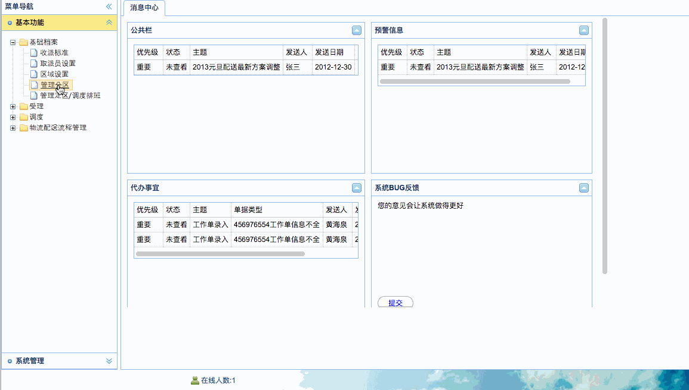

[TOC]


# BOS物流项目62———Highcharts3\_3D饼状图展示区域分区分布图

## 一、在subarea.jsp页面中引入Highcharts资源文件

jsp中导入相关js文件，依赖于jQuery,这里面。

导入以下文件

```html
    <script type="text/javascript" src="${pageContext.request.contextPath }/js/jquery-1.8.3.js"></script>
    <script type="text/javascript" src="${pageContext.request.contextPath }/js/highcharts/highcharts.js"></script>
    <script type="text/javascript" src="${pageContext.request.contextPath }/js/highcharts/highcharts-3d.js"></script>
    <script type="text/javascript" src="${pageContext.request.contextPath }/js/highcharts/modules/exporting.js"></script>
```


---


## 二、在jsp页面中提供按钮，并提供div窗口，在这个窗口中展示图表


```html
     .......
     {
		id : 'button-doShowHighcharts',
		text : '显示区域分布图',
		iconCls : 'icon-search',
		handler : doShowHighcharts
	}
     
      ......
     
     $('#showSubareaWindow').window({
			width: 600,
			modal: true,
			shadow: true,
			closed: true,
			height: 500,
			resizable:false
		});
     
    ......
    	function doShowHighcharts(){
		   $("#showSubareaWindow").window("open");
		}
    .......
    <%--区域分区分布图--%>
	<div class="easyui-window" title="区域分区分布图" id="showSubareaWindow" collapsible="false" minimizable="false" maximizable="false" style="top:20px;left:200px">
		<div id="container" split="false" border="false">
		</div>
	</div>
	
	.....
```


----

## 三、jsp中定义方法 doShowHighcharts

```html

```


---


## 四、在服务端Action中提供方法

饼状图需要的数据是 这样的

```json
[
  ['北京', 1],
  ['天津',  1]
}                

```

数组中包含了一个数组，里面的数组，第一个对象是**对应的省市名称**，第二个对象是占比


**Action添加方法**

```java

    /**
     * 查询区域分布图数据
     * @return
     */
    public String findSubareasGroupByProvince(){
        List<Object> list = subareaService.findSubareasGroupByProvince();
        java2Json(list,new String[]{});
        return NONE;
    }
```


## 五、在服务端Dao中提供方法

```java

    /**
     * 查询区域分布图数据
     *
     * @return
     */
    @Override
    public List<Object> findSubareasGroupByProvince() {
        String hql = "SELECT r.province,count(*) FROM Subarea s LEFT OUTER JOIN s.region r GROUP BY r.province";
        return (List<Object>) getHibernateTemplate().find(hql);
    }
```


----


## 六、图示





---


## 七、源码下载

[https://github.com/wimingxxx/bos-parent](https://github.com/wimingxxx/bos-parent/)