[TOC]

# BOS物流项目63———Linux中安装JDK和Tomcat

## 一、安装Linux系统

安装请看教程

[第1章 部署虚拟环境安装linux系统](http://www.linuxprobe.com/chapter-01.html)

---

## 二、安装JDK

### 2.1 下载Linux版的jdk

到官网下载对应的jdk,

[http://www.oracle.com/technetwork/java/javase/downloads/index.html](http://www.oracle.com/technetwork/java/javase/downloads/index.html)

例如

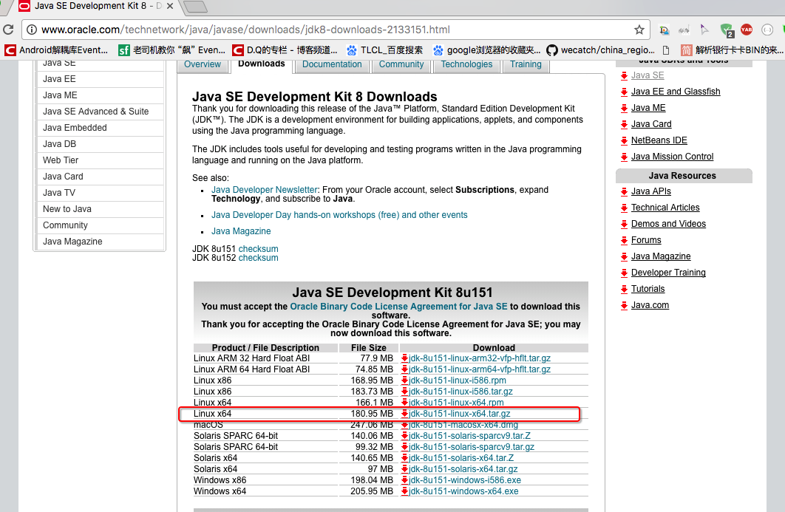

### 2.2 通过Xshell连接到Linux服务器

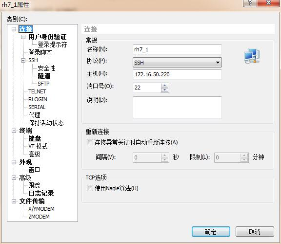

### 2.3 使用命令创建一个目录，作为软件的安装目录

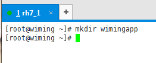

### 2.4 将本地windows系统中的jdk安装包上传到Linux系统中

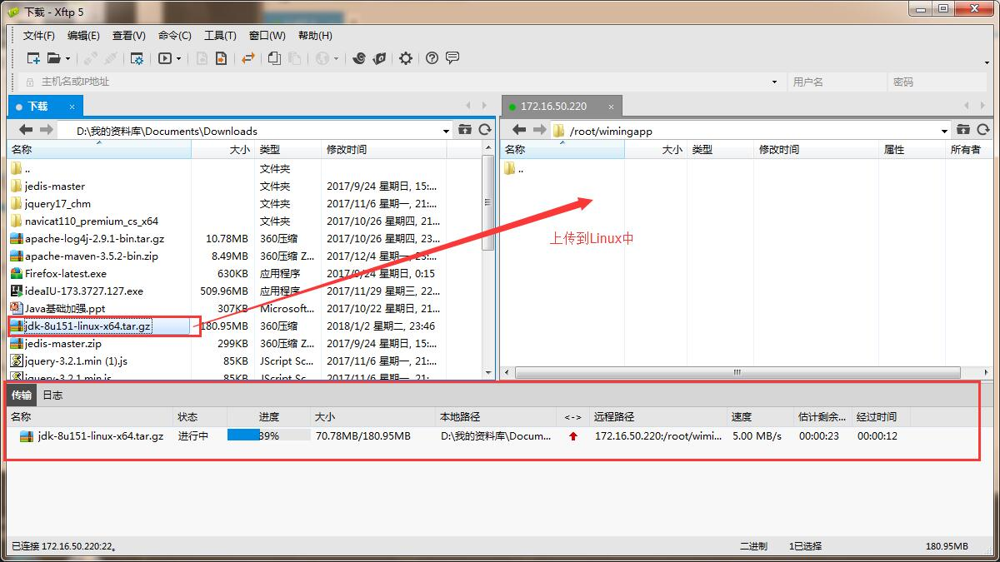

### 2.5 第五步：解压jdk压缩包

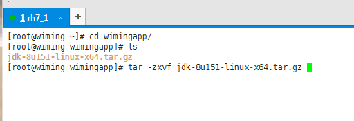


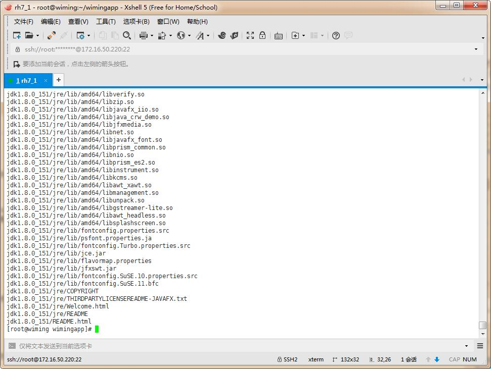


### 2.6 在/etc/profile文件中配置jdk的环境变量

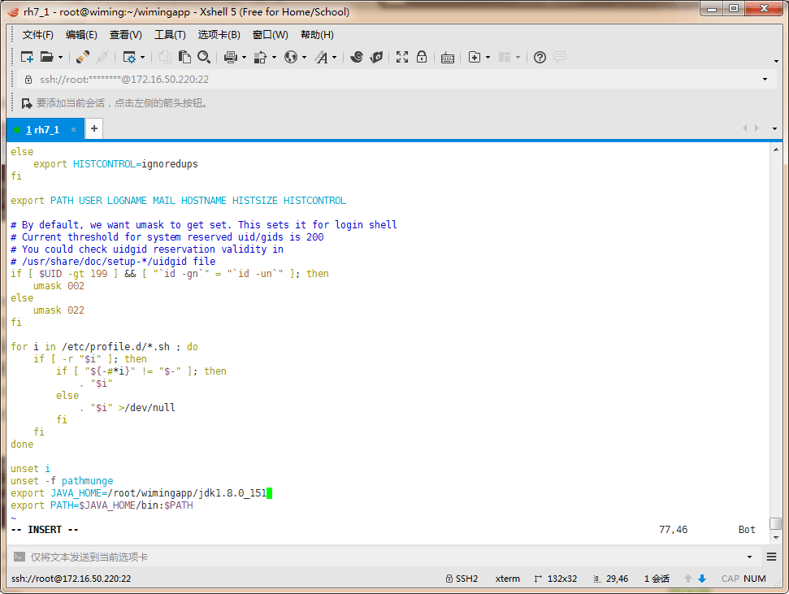


### 2.7 重新加载profile文件

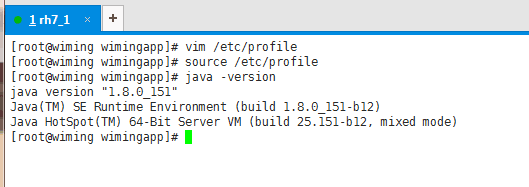

到此，我们的 jdk 的安装完成了。下面就是 Tomcat的安装了

-----

## 三、安装Tomcat

### 3.1 下载对应的Tomacat

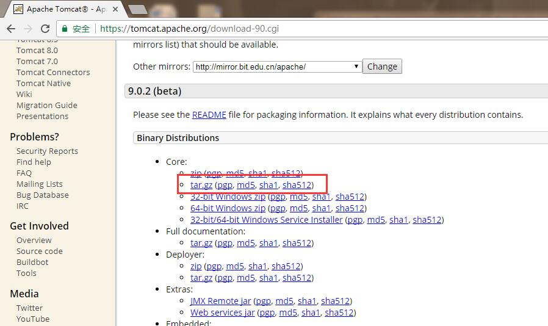

### 3.2 将本地tomcat安装包上传到Linux系统

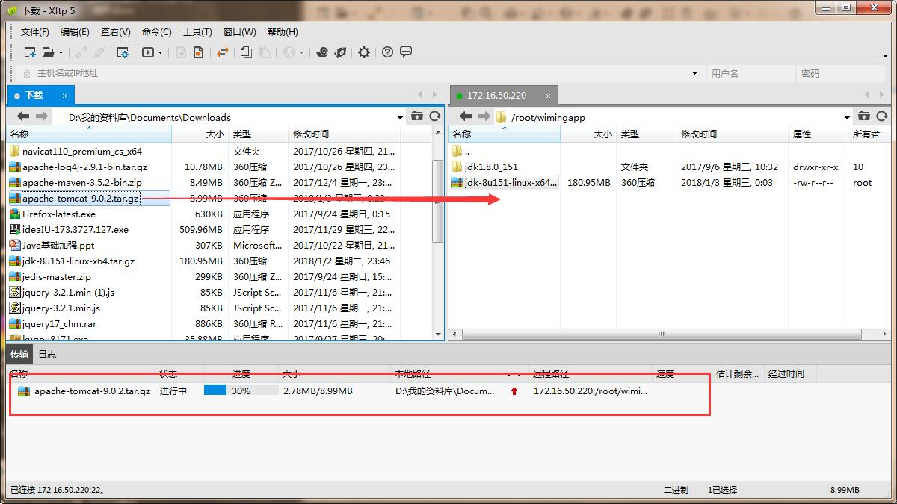

### 3.3 解压tomcat安装包

### 3.4 使用tomcat的启动脚本启动服务器

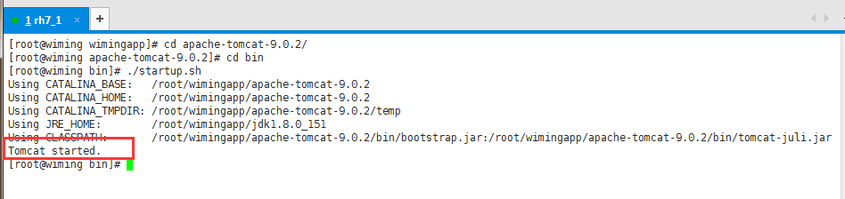

### 3.5 查看tomcat的启动日志

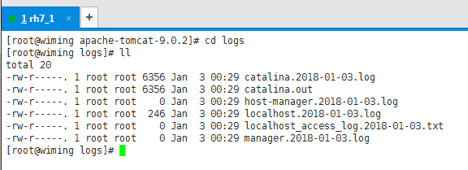

### 3.6 关闭防火墙

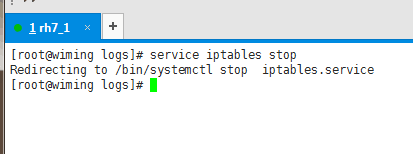

### 3.7 访问Linux中的Tomcat

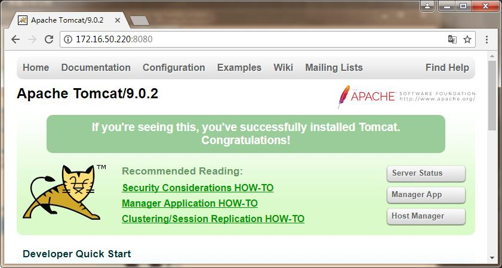

----

## 四、源码下载

[https://github.com/wimingxxx/bos-parent](https://github.com/wimingxxx/bos-parent/)